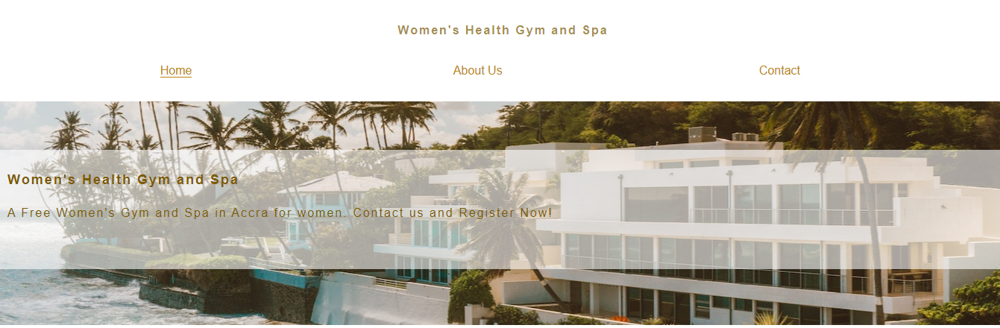

Women's Health Gym and Spa

The Women's Health Gym and Spa (WHGS) is a  website that gives information about a gym and spa for women in Accra, Ghana. Many women in Accra have a lack of access to healthcare due to issues such as poverty, lack of time to dedicate to their self-care, and less freedom of movement due to cultural or religious grounds. WHGS was created to give women more access to health facilities and specialists to help women in their fitness and wellness journeys. 
 The WHGS is aimed at all women living in Accra, Ghana. The WHGS is funded by the Women's Health Foundation, which is why it is free for all women. However, since the facilities are free to use for all women, it is important for potential users to register on the website, since WHGS operate on a first-come, first-served registration and booking system. Once their registration is approved, users will later be contacted and invited by WHGS to make their bookings for sessions at the gym and/or spa. 
The WHGS not only provides free health and wellness facilites to women, it is also located on a private and secluded area near the beach. Since some women from certain cultural and religious groups may be uncomfortable sharing health and wellness facilities with men, the all-female staff in the gym and spa for only women should be confortable for women from all backgrounds to attend. The beautiful and secluded building and environment near the beach will also fulfill all the requirements of privacy that some women may want.
The WHGS is targeted at all women living or visiting Accra, Ghana who want to make use of its facilities. However, more specifically, it targets women who may lack access to health, fitness and wellness facilities and specialists due to lack of finance, or discomfort sharing these kinds of facilities with men, especially due to cultural, religious, family or personal beliefs. The website  gives women initial information about WHGS, gives its contact details, and allow women to register for use of its facilities.

[picture of responsiveness section](documentation-images/am-i-responsive-screen-shot.png)

Features
The webpage consists of three different sections (header, about us, contact) and a footer (social media links).

The Header Section

The header section includes the name ”Women's Health Gym and Spa” at the very top on the page so that users will immediately know the wesite that they are on. Underneath that sits the menu 	navigation bar, so that users that may only want specific bits of 	information may quickly navigate their way to the correct section.

Beneath the navigation bar, lies a hero-image with a photograph of the WHGS building in Accra next to the sea. When a user sees the photo, it should reflect the beauty of the building and environment around it, which should look inviting to users to go to. The size of the building can give the impression of the many probably facilities that it houses, and the secluded area of the building reflects how much privacy that women of different backgrounds can have within its grounds.

Additionally, a white, transparent cover text box overlays the photograph , which does not hide the photograph behind it. Yet it also gives users initial important information of gym name, shows that it is free and for women, and that one should register and book for sessions. This should create greater interest for users to continue scrolling down the page.    
 
Navigation Bar
The navigation bar has a menu list of ”Home”, ”About Us” and ”Contact”. All three of these are linked to their respectively labelled sections throughout the webpage, which allows for easy navigation among the different sections. The ”Contact” section not only has the contact details of WHGS, it is also where the registration form can be found.

About Us Section

[picture of about us section top](documentation-images/about-us-section.1.png)

[picture of about us section bottom half](documentation-images/about-us-section.2.png)

The About Us section gives further bits of information about the WHGS labelled ”What we do”, ”Why we are free”, ”Free health professionals” and ”Contact and Register”. All of these fields give a little bit more understanding about the purpose of WHGS, why they are able to offer free services, what facilities they have and how to have access to their facilities and services through registration. This will encourage the user to register with WHGS and get information as to what users are signing up for.

Underneath the information section is a bordered picture of a woman in a gym class with other women, to inspire users to think about what a typical WHGS class might look like. A visual form of information, in addition to the written form of information in the ”About Us” section will appeal to users to join this gym and spa. 

Contact and Footer Section

[picture of contact and footer section](documentation-images/contact-and-footer-section.png)

The contact section underneath the ”About Us” section has the main contact details of WHGS and a registration form for users to register to become users of its facilities.

The registration form is in the contact section, because it is another way of making contact with WHGS. Thus anybody who wants to connect with WHGS via visiting at the stated address, phoning the stated number, or registering for their facilities can do so. Users are asked to give their name, address and email number and will not be able to submit an empty form.

Underneath the registration form, there is a background photo of a woman with a towel on her head and a smile, as she touches her face, giving users the impression of a satisfied, happy and relaxed customer. This shows the spa and relaxation aspect of WHGS, which would encourage visitors to go to the spa. 

The three social media links in the footer opens up onto their respective websites in another page once clicked on. The social media links are important to continuosly maintain the users interests when they follow WHGS. Additionally they can be alerted of any changes or news that WHGS may want to share with their users.

Features Left to Implement
A booking form will be implemented later in order for users to book times and dates for the sessions that they would like to attend. The website will also have additional pages with information about the different facilities and sessions to be found at the gym and spa.

Testing
This project has screen size responsiveness on screen sizes: 
320px-480px
481px-768px
769px-1024
1025px-1200px
1201px and above

Two minor bug were found within the CSS and HTML code validations, but they were easily solved, so there were no particularly interesting bugs found within this project.
Validator Testing
There were no errors found when the CSS code was run through the official W3C validator.
There were no errors found when the HTML code was run through the official W3C jigsaw validator.
The Lighthouse Accessibility score is 97, which confirms that it is accessible and easy to read to users.

[picture of lighthouse validation results](documentation-images/Lighthouse-validation-results.png)

Deployment
This section should describe the process you went through to deploy the project to a hosting platform (e.g. GitHub)
The site was deployed to GitHub pages. The steps to deploy are as follows:
In the GitHub repository, navigate to the Settings tab
From the source section drop-down menu, select the Master Branch
Once the master branch has been selected, the page will be automatically refreshed with a detailed ribbon display to indicate the successful deployment.
The live link can be found here - https://code-institute-org.github.io/love-running-2.0/index.html
Credits
Content
The structure and layout of the project website was taken from the Code Institute's ”Love Running” tutorials.
The icons used in the footer for the social media links came from the website, font awesome. Please see the link here: https://fontawesome.com/ 
In page navigation links were taken from a YouTube tutorial. Please see the link here: https://www.youtube.com/watch?v=xSTVTT3cx0w

Navigation links lessons were taken from my notes on the Code Institute's ”Nav Challenge” website. Please see the link here: https://learn.codeinstitute.net/courses/course-v1:CodeInstitute+HE101+2020/courseware/fcc67a894619420399970ae84fc4802f/889f243764aa4ac6b355edcce64af755/

The registration form were referenced from the Signup form challenges 1 and 2. on the Code Institute's website. 
The Link through the submit button on the registration form was taken from the form challenge in the html secction of the Code Institute's website. Please see the link here: https://formdump.codeinstitute.net/"
Media
The photos used as the hero image on the ”home” section, the ”About Us section” and the ”contact” section of the webpage are from the www.pexels.com website.
